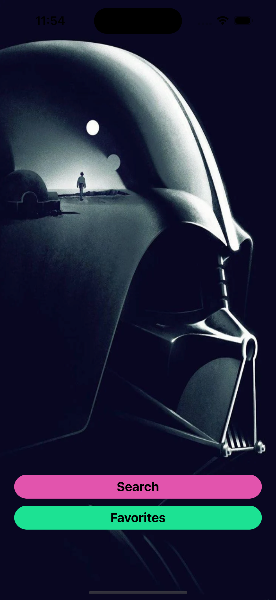
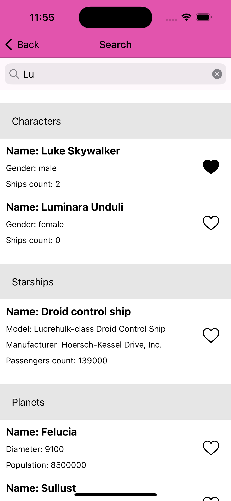
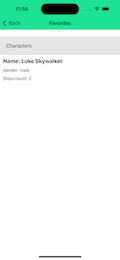

# StarWars
  

Приложении умеет искать персонажей, космолеты, планеты в апишке https://swapi.dev/api/

Сделал три экрана -главный -поиск -избранное

Сцены поиск и избранное по архитектуре MVP. Сцены вызываются из главного экрана, в идеале сделать чтобы контроллер который открывает экран он его и закрывал. Но сейчас тут просто навигация, передачи данных нет между главным экраном.

На экране поиска и избранного использую таблицу. Добавил в проект менеджер TableViewManager для работы с таблицами. Его взял из своего другого проекта. Менеджер имеет много методов для работы с таблицей, они сейчас не используются, но в будущем если будут новые таблицы то могут пригодиться.

Подключил две библиотеки:
-Alamofire, для работы с сетью, можно было обойтись без него
-Snapkit, для быстрой верстки в коде

Для хранения данных использую CoreData.

Ячейки для двух экранов общие.

В таблице есть группировка по секциям.
