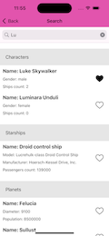

# StarWars
  

Приложение умеет искать персонажей, космолеты, планеты в апишке https://swapi.dev/api/

Три экрана:    
-main  
-search  
-favorites

Сцены search и favorites написаны по MVP архитектуре. Сцены вызываются из главного экрана main.

На search и favorites использую таблицу. Добавил в проект менеджер TableViewManager для работы с таблицами. Менеджер имеет много методов для работы с таблицей, они сейчас не используются, но в будущем если будут новые таблицы то могут пригодиться.

Подключил две библиотеки через spm:
-Alamofire
-Snapkit

Для хранения данных использую CoreData.

Ячейки для двух экранов общие.
